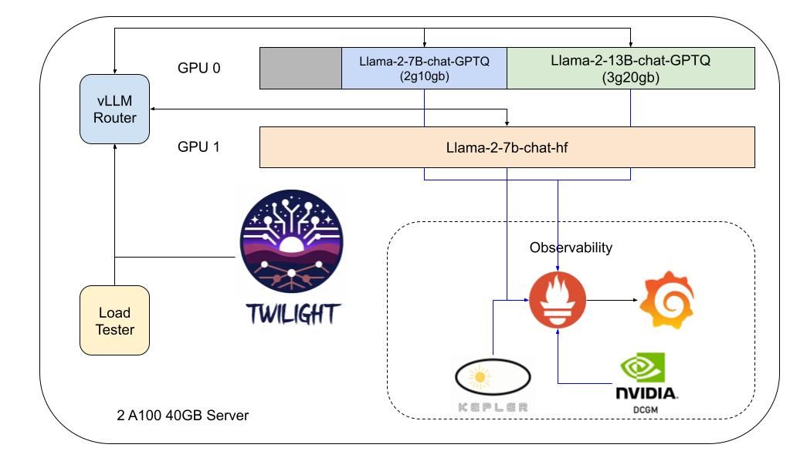

# Architecture Overview
This diagram serves as an architecture overview, detailing the deployment of our large language models, the routing mechanism, and the observability setup within our infrastructure.

## Backend Infrastructure
Our backend infrastructure is built upon a server equipped with two NVIDIA A100 40GB GPUs. We utilize [Kubernetes v1.28.6](https://v1-28.docs.kubernetes.io/docs/setup/production-environment/tools/kubeadm/create-cluster-kubeadm/) for container orchestration and have deployed the [GPU operator](https://docs.nvidia.com/datacenter/cloud-native/gpu-operator/23.9.1/getting-started.html) to manage our GPU resources effectively.

## Large Language Model(LLM) Server Deployment
We host three distinct Llama models across the two GPUs to power our backend services:
1. **[Llama-2-7B-chat](https://huggingface.co/meta-llama/Llama-2-7b-chat-hf) model**: This model occupies an entire A100 GPU, providing substantial computational power for processing complex language tasks.
2. **[Llama-2-7B-chat-GPTQ](https://huggingface.co/TheBloke/Llama-2-7B-Chat-GPTQ) model**: Deployed on a 2g10gb MIG slice, this quantized model is optimized for efficient performance.
3. **[Llama-2-13B-chat-GPTQ](https://huggingface.co/TheBloke/Llama-2-13B-chat-GPTQ) model**: Running on a larger 3g20gb MIG slice, this model offers enhanced capabilities for more demanding language processing needs.

## Request Routing
To facilitate seamless interaction between the load tester, the application, and our models, we employ a [vLLM Router](https://github.com/LLM-inference-router/vllm-router.git). This router intelligently directs incoming requests to the appropriate backend server based on the model name specified within the request payload.

## Front-End Application
[Twilight Chat](https://github.com/Twilight-Tales/Twilight-Chat) serves as the front-end application, acting as a virtual book club host to assist the elderly with reading activities. It connects to our backend LLM servers through the vLLM Router, ensuring smooth communication and service delivery.

## Observability
To monitor system performance and energy consumption, we have integrated observability tools such as [NVIDIA DCGM](https://github.com/NVIDIA/dcgm-exporter) and [Kepler](https://github.com/sustainable-computing-io/kepler) with Prometheus. The collected data is then visualized in a Grafana dashboard, allowing us to maintain a high level of system awareness and performance optimization.
